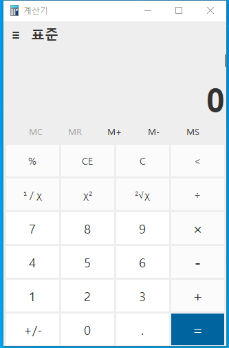
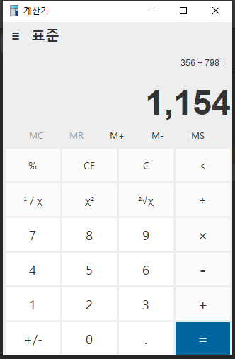

# 소개

이 프로젝트는 간단한 계산기 애플리케이션입니다. 기본적인 사칙연산 기능을 제공하며, Java와 Swing을 활용해 GUI 인터페이스를 구성합니다. 연산에 따라 폰트 크기를 동적으로 조절하여, UI의 가독성을 높였습니다.

## 스크린샷

| 기능           | 이미지                                                                                                                                                                                                  |
| -------------- |------------------------------------------------------------------------------------------------------------------------------------------------------------------------------------------------------|
| 메인 화면      |  |
| 계산 예시 화면 |                                                                                                                                                                     |


## 주요 기능

- **사칙연산**: 더하기, 빼기, 곱하기, 나누기 연산 지원
- **결과 미리보기**: 연산 과정과 결과를 별도의 창에 실시간으로 표시
- **폰트 크기 조절**: 결과값 길이에 따라 폰트 크기 자동 조정
- **오류 처리**: 스택 오버플로우나 잘못된 입력 방지

## 사용 기술

- **Java**: 전체 계산 로직 및 Swing GUI 구성
- **Swing**: GUI 구성 요소 및 레이아웃 관리
- **Capsule Render**: 프로젝트 제목 및 설명에 캡슐형 헤더 추가

## 설치 및 실행 방법

1. 이 레포지토리를 클론합니다:

   ```bash
   git clone https://github.com/Jiu125/fitst-git-repository.git
   ```

2. Java 개발 환경을 설정합니다. (Java 8 이상 권장)

3. IDE에서 `java.Calculator` 클래스를 실행하여 애플리케이션을 시작합니다.

## 기여 방법

1. 이 프로젝트를 포크합니다.
2. 기능을 추가하거나 버그를 수정합니다.
3. 변경 사항을 커밋합니다 (`git commit -m 'Add new feature'`).
4. 브랜치에 푸시합니다 (`git push origin feature-branch`).
5. 풀 리퀘스트를 제출합니다.

## 업데이트 내역

<ul>
 <li>2023-10-13 : 최초 생성 </li>
 <li>2023-10-22 : 초기 디자인 완성 </li>
 <li>2023-10-28 : 연산 기능 구현 성공</li>
 <li>2023-10-30 : 디자인 수정 및 오류 해결</li>
</ul>

# 출처

  ```
  @software{2023011794_Calcultor-Java},
    author = {Jiwoo, Park},
    title = {Calcultor-Java},
    year = {2024},
    publisher = {GitHub},
    journal = {GitHub repository},
    howpublished = {\url{https://github.com/Jiu125/fitst-git-repository},
  }
  ```
